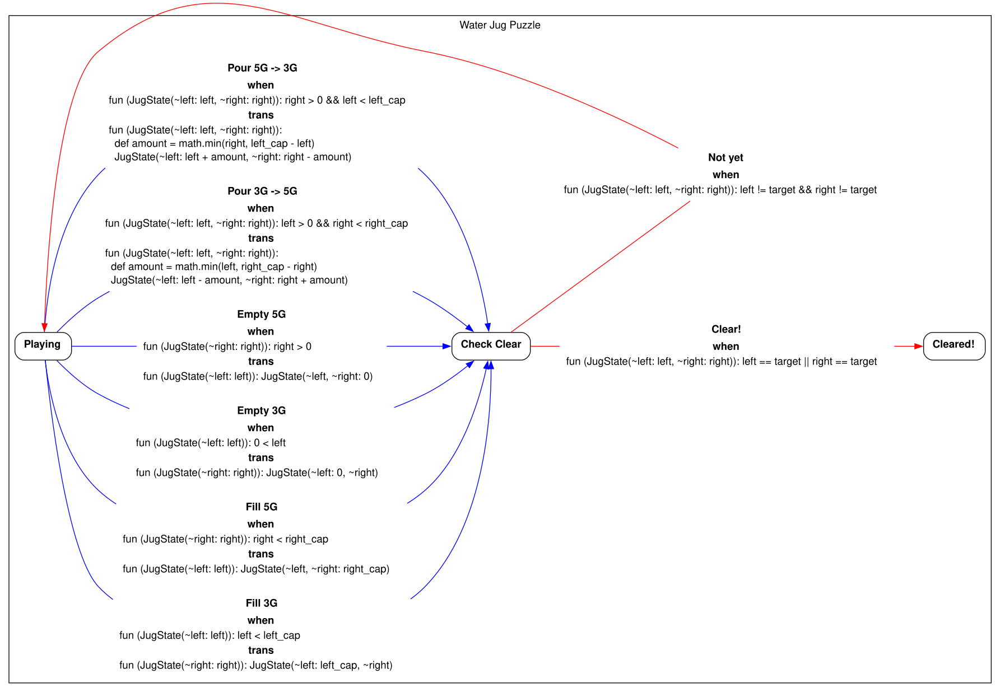

rhombus-graph-executor
======================

Rhombus bindings for [graph-executor](https://github.com/tojoqk/graph-executor).

## Quick Start



```rhombus
#lang rhombus

import lib("rhombus-ugraph-executor") open

class JugState(left, right)

fun jug_graph(g, left_cap, right_cap, target):
  when left_cap == right_cap
  | error(@str{jug_graph: must not be same caps (@left_cap, @right_cap)})

  fun show_cleared(st):
    message(@str{Congratulations! You made exactly @target gallons!})
    st

  fun fill_left(st):
    message(@str{Filled the @(left_cap)-gallon jug.})
    JugState(left_cap, st.right)

  fun fill_right(st):
    message(@str{Filled the @(right_cap)-gallon jug.})
    JugState(st.left, right_cap)

  fun empty_left(st):
    message(@str{Emptied the @(left_cap)-gallon jug.})
    JugState(0, st.right)

  fun empty_right(st):
    message(@str{Emptied the @(right_cap)-gallon jug.})
    JugState(st.left, 0)

  fun pour_left_to_right(st):
    def amount = math.min(st.left, right_cap - st.right)
    def new_left = st.left - amount
    def new_right = st.right + amount
    message(@str{Poured @amount gallons from @(left_cap)G to @(right_cap)G})
    JugState(new_left, new_right)

  fun pour_right_to_left(st):
    def amount = math.min(st.right, left_cap - st.left)
    def new_right = st.right - amount
    def new_left = st.left + amount
    message(@str{Poured @amount gallons from @(right_cap)G to @(left_cap)G})
    JugState(new_left, new_right)

  fun can_fill_right(st): st.right < right_cap
  fun can_fill_left(st): st.left < left_cap
  fun can_empty_right(st): st.right > 0
  fun can_empty_left(st): st.left > 0

  fun can_pour_right_to_left(st): st.right > 0 && st.left < left_cap
  fun can_pour_left_to_right(st): st.left > 0 && st.right < right_cap

  fun is_cleared(st): st.left == target || st.right == target
  fun not_cleared(st): !is_cleared(st)

  fun prompt_playing(st):
    @str{Goal: Make exactly @(target)G
           Current Status:
             [ @(left_cap)G Jug: @(st.left)/@(left_cap) | @(right_cap)G Jug: @(st.right)/@(right_cap) ]
           What will you do?}
  def make_node = node_maker(g)
  def playing = make_node("Playing", ~type: #'puzzle, ~prompt: code(prompt_playing))
  def check_clear = make_node("Check_Clear Clear", ~type: #'check_clear)
  def cleared = make_node("Cleared!", ~type: #'terminal, ~trans: code(show_cleared))

  def edges = [
    make_edge(@str{Fill @(left_cap)G}, ~from: playing, ~to: check_clear, ~when: code(can_fill_left), ~trans: code(fill_left)),
    make_edge(@str{Fill @(right_cap)G}, ~from: playing, ~to: check_clear, ~when: code(can_fill_right), ~trans: code(fill_right)),
    make_edge(@str{Empty @(left_cap)G}, ~from: playing, ~to: check_clear, ~when: code(can_empty_left), ~trans: code(empty_left)),
    make_edge(@str{Empty @(right_cap)G}, ~from: playing, ~to: check_clear, ~when: code(can_empty_right), ~trans: code(empty_right)),
    make_edge(@str{Pour @(left_cap)G -> @(right_cap)G}, ~from: playing, ~to: check_clear, ~when: code(can_pour_left_to_right), ~trans: code(pour_left_to_right)),
    make_edge(@str{Pour @(right_cap)G -> @(left_cap)G}, ~from: playing, ~to: check_clear, ~when: code(can_pour_right_to_left), ~trans: code(pour_right_to_left)),
    make_edge("Not yet", ~mode: #'auto, ~from: check_clear, ~to: playing, ~when: code(not_cleared)),
    make_edge("Clear!",  ~mode: #'auto, ~from: check_clear, ~to: cleared, ~when: code(is_cleared))
  ]

  values(make_graph(g, ~edges), playing)

fun make_model(left_cap, right_cap, target):
  def proc = fun ():
    def values(graph, node_init) = jug_graph("Water Jug Puzzle", left_cap, right_cap, target)
    values([graph], node_init, JugState(0, 0))
  model(proc)

module main:
  import rhombus/cmdline open

  def options:
    parse:
      ~init: { #'mode: #'dot }
      once_any:
        flag "--dot":
          ~help: "Generate dot"
          state[#'mode] := #'dot
        flag "--console":
          ~help: "Run console"
          state[#'mode] := #'console
        flag "--random":
          ~help: "Run random"
          state[#'mode] := #'random

  def m = make_model(3, 5, 4)
  def trace_display = #'hide
  match options[#'mode]
  | #'dot:
      render_dot(m)
  | #'console:
      def commands = [[#'quit, #'q, "Quit"]]
      def config = console_config(~commands, ~trace_display)
      console_run(m, ~config)
      #void
  | #'random:
      def chooser = fun (_): #'random
      def config = console_config(~chooser, ~trace_display)
      def j = console_run(m, ~config)
      def steps = for values(cnt = 0) (e in j):
        if e[0] == #'choose
        | cnt + 1
        | cnt
      println(@str{Solved in @steps steps!})

module test:
  def m = make_model(3, 5, 4)
  fun is_terminal_node(x): node_info_type(x) == #'terminal
  check:
    find_livelock(m) ~is #false
    find_deadlock(m, is_terminal_node) ~is #false
    find_false_terminal(m, is_terminal_node) ~is #false
    find_auto_conflict(m) ~is #false
    find_counterexample(m, fun (n, st): st.left >= 0 && st.left <= 3) ~is #false
```

## License

Apache License 2.0. See [LICENSE](LICENSE) for details.
